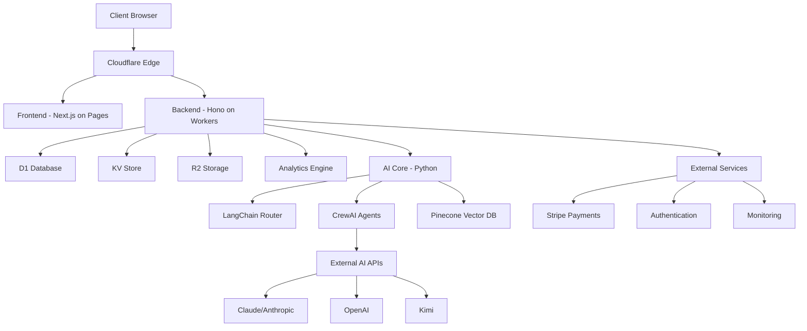
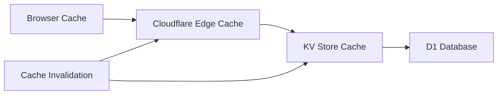

# CLAUDE.md: ProtoThrive Technical Documentation

**Version**: 2.0.0
**Last Updated**: September 27, 2025
**Project**: ProtoThrive - AI-First SaaS Platform for Visual Prototyping

---

## 1. Project Purpose & Vision

### What is ProtoThrive?
ProtoThrive is an AI-first SaaS platform that revolutionizes software development through intelligent visual prototyping and automated development workflows. The platform combines 2D/3D visual roadmap management with a sophisticated multi-agent AI system to accelerate development cycles by 60%.

### Mission Statement
To democratize software development by providing enterprise-grade AI assistance that transforms complex development tasks into intuitive visual workflows, enabling teams to prototype, build, and deploy faster than ever before.

### Target Audience
- **Enterprises**: Large organizations seeking to accelerate digital transformation
- **SMBs**: Small to medium businesses needing rapid prototyping capabilities
- **Individual Developers**: Engineers looking for AI-powered development assistance
- **Product Teams**: Cross-functional teams requiring visual collaboration tools

### Core Value Proposition
- **60% faster development cycles** through AI automation
- **Visual-first approach** with 2D/3D roadmap management
- **Enterprise-grade security** with multi-tenant isolation
- **Real-time collaboration** with "Thrive Score" progress tracking
- **Multi-agent AI system** with 14 specialized development agents

---

## 2. System Overview

ProtoThrive operates as a comprehensive development platform that bridges the gap between ideation and implementation. Users create visual roadmaps using an intuitive drag-and-drop interface, which are then processed by our AI agent swarm to generate code, perform reviews, handle deployments, and maintain quality standards.

### Key Capabilities
- **Visual Roadmap Builder**: Interactive 2D/3D canvas with React Flow and Spline integration
- **AI Agent Orchestration**: 14 specialized agents for planning, coding, testing, security, and deployment
- **Real-time Collaboration**: Multi-user editing with live updates and conflict resolution
- **Thrive Score Analytics**: Dynamic project health metrics and progress tracking
- **Template Library**: Pre-built patterns and snippets for rapid development
- **Enterprise Security**: JWT authentication, rate limiting, and OWASP compliance
- **Memory Optimization**: Advanced memory management with automated cleanup and monitoring
- **Performance Monitoring**: Real-time performance tracking with SLA compliance
- **Comprehensive Auditing**: Multi-dimensional code quality assessment with security analysis

### End-to-End Workflow
1. **Ideation**: Create visual roadmaps with nodes representing features/tasks
2. **Planning**: AI agents decompose roadmaps into actionable development tasks
3. **Implementation**: Code generation and review through specialized AI agents
4. **Testing**: Automated test generation with 98% coverage requirements
5. **Deployment**: Continuous integration to Cloudflare Workers and Pages
6. **Monitoring**: Real-time performance tracking and health monitoring

---

## 3. Tech Stack

### Frontend Technologies
- **Framework**: Next.js 14.2.32 with App Router
- **Language**: TypeScript 5.9.2
- **State Management**: Zustand 4.4.7
- **UI Components**: React 18.2.0, Tailwind CSS 4.1.13
- **Visualization**: React Flow 11.10.1, Spline 3D 4.1.0
- **Animation**: Framer Motion 10.16.16
- **Icons**: Heroicons 2.0.18, Lucide React 0.294.0

### Backend Technologies
- **Runtime**: Cloudflare Workers with Node.js compatibility
- **Framework**: Hono 4.2.0 (high-performance edge framework)
- **Language**: TypeScript 5.0+
- **Database**: Cloudflare D1 (SQLite-based)
- **Storage**: Cloudflare KV (key-value), R2 (object storage)
- **Authentication**: JWT with jose 5.2.0, bcrypt 5.1.1
- **Validation**: Zod 3.23.0

### AI & Automation
- **Language**: Python 3.12+
- **Orchestration**: LangChain, CrewAI multi-agent framework
- **Vector Database**: Pinecone for RAG (Retrieval Augmented Generation)
- **AI Models**: Claude (Anthropic), OpenAI, Kimi for cost optimization
- **Workflow Engine**: n8n for automation pipelines

### Development & Deployment
- **Build Tools**: TypeScript compiler, Wrangler 3.0+
- **Testing**: Jest 30.1.0, pytest, React Testing Library
- **Linting**: ESLint 8.50+, Prettier, Pylint
- **CI/CD**: GitHub Actions with automated deployment
- **Monitoring**: Custom analytics, error tracking, performance metrics

---

## 4. Architecture

### System Architecture Overview
ProtoThrive follows a microservices-oriented edge-first architecture designed for global scalability and low latency. The system leverages Cloudflare's edge computing platform to provide sub-10ms response times worldwide.



### Component Architecture
- **Edge Layer**: Cloudflare Workers and Pages for global distribution
- **API Gateway**: Hono-based routing with middleware for auth, rate limiting, CORS
- **Service Layer**: Domain-specific services (Roadmap, User, Snippet, AI Orchestration)
- **Data Layer**: D1 for relational data, KV for caching, R2 for file storage
- **AI Layer**: Python-based agents with model routing and cost optimization
- **Integration Layer**: External APIs for payments, authentication, and monitoring

### Data Flow
1. **Request**: Client makes API request through Cloudflare Edge
2. **Authentication**: JWT validation and user context establishment
3. **Rate Limiting**: Request throttling based on user tier and endpoint
4. **Business Logic**: Service layer processes request with data validation
5. **Data Access**: Database queries with caching layer optimization
6. **AI Processing**: Agent orchestration for complex operations
7. **Response**: Formatted JSON response with appropriate headers

---

## 5. Core Features

### Visual Roadmap Management
- **Interactive Canvas**: Drag-and-drop node editor with 2D/3D view modes
- **Real-time Collaboration**: Multi-user editing with conflict resolution
- **Template Library**: Pre-built roadmap templates for common use cases
- **Version Control**: Roadmap history and branching capabilities
- **Export/Import**: JSON schema support for roadmap portability

### AI Agent System (14 Specialized Agents)
- **Strategic Planner**: Roadmap analysis and task decomposition
- **TDD Implementer**: Test-driven development with 95%+ coverage
- **Security Auditor**: OWASP compliance and vulnerability scanning
- **Performance Optimizer**: Code optimization and latency reduction
- **Architecture Enforcer**: SOLID principles and scalability validation
- **Grug Code Reviewer**: Simplicity-focused code review
- **Documentation Generator**: Automatic API docs and code comments
- **CI/CD Integrator**: Deployment pipeline automation
- **Runtime Monitor**: Production monitoring and anomaly detection
- **Proactive Debugger**: Bug hunting and edge case testing
- **Edge Innovator**: Cutting-edge technology integration
- **Tester Validator**: Comprehensive test suite generation
- **SWE-Bench Evaluator**: Code quality assessment
- **Orchestrator Lead**: Multi-agent coordination and conflict resolution

### Thrive Score Analytics
- **Real-time Metrics**: Dynamic calculation based on completion, quality, and risk
- **Progress Tracking**: Visual indicators for project health and momentum
- **Predictive Analytics**: AI-powered project timeline estimation
- **Team Performance**: Individual and team productivity insights
- **Custom Dashboards**: Configurable metrics and reporting

### Enterprise Security Features
- **Multi-tenant Architecture**: Complete data isolation between organizations
- **JWT Authentication**: Secure token-based authentication with refresh tokens
- **Role-based Access Control**: Granular permissions for different user types
- **Rate Limiting**: Configurable request throttling and DDoS protection
- **Audit Logging**: Comprehensive activity tracking and compliance reporting
- **Encryption**: End-to-end encryption for sensitive data

---

## 6. Configuration

### Environment Variables

| Variable | Type | Required | Description |
|----------|------|----------|-------------|
| `NODE_ENV` | string | Yes | Application environment (development/staging/production) |
| `JWT_SECRET` | string | Yes | 64+ character secret for JWT token signing |
| `CLOUDFLARE_ACCOUNT_ID` | string | Yes | Cloudflare account identifier |
| `D1_DATABASE_ID` | string | Yes | Cloudflare D1 database identifier |
| `KV_NAMESPACE_ID` | string | Yes | Cloudflare KV namespace identifier |
| `CLAUDE_API_KEY` | string | Yes | Anthropic Claude API key |
| `OPENAI_API_KEY` | string | No | OpenAI API key for additional AI capabilities |
| `STRIPE_SECRET_KEY` | string | No | Stripe secret key for payment processing |
| `RATE_LIMIT_REQUESTS_PER_MINUTE` | number | No | API rate limit (default: 100) |
| `CACHE_TTL_SECONDS` | number | No | Cache time-to-live (default: 3600) |
| `LOG_LEVEL` | string | No | Logging verbosity (info/debug/error) |

### Cloudflare Bindings

#### D1 Database
```toml
[[env.production.d1_databases]]
binding = "DB"
database_name = "protothrive-db-prod"
database_id = "your-production-d1-database-id"
```

#### KV Storage
```toml
[[env.production.kv_namespaces]]
binding = "KV_STORE"
id = "your-production-kv-namespace-id"
```

#### R2 Object Storage
```toml
[[env.production.r2_buckets]]
binding = "R2_BUCKET"
bucket_name = "protothrive-uploads-prod"
```

### Feature Flags
- `ENABLE_BETA_FEATURES`: Enable experimental features
- `ENABLE_DEBUG_MODE`: Verbose logging and debug endpoints
- `ENABLE_PERFORMANCE_MONITORING`: Real-time performance tracking
- `AUTO_DEPLOY_ENABLED`: Automatic deployment on successful builds

---

## 7. Deployment Guide (Cloudflare)

### Prerequisites
- Node.js 20.0.0 or higher
- npm 10.0.0 or higher
- Cloudflare account with Workers Paid plan
- Wrangler CLI installed globally: `npm install -g wrangler`

### Local Development Setup

1. **Clone Repository**
   ```bash
   git clone <repository-url>
   cd ProtoThrive2
   ```

2. **Install Dependencies**
   ```bash
   npm run install-all
   ```

3. **Environment Configuration**
   ```bash
   cp .env.example .env
   # Edit .env with your actual values
   ```

4. **Database Setup**
   ```bash
   # Create D1 database
   wrangler d1 create protothrive-db-dev

   # Run migrations
   wrangler d1 execute protothrive-db-dev --local --file=backend/migrations/001_init.sql
   ```

5. **Start Development Servers**
   ```bash
   # Start both frontend and backend
   npm run dev

   # Or individually
   npm run dev -w backend    # Backend on localhost:8787
   npm run dev -w frontend   # Frontend on localhost:3000
   ```

### Production Deployment

1. **Build Applications**
   ```bash
   npm run build
   ```

2. **Deploy Backend to Workers**
   ```bash
   cd backend
   wrangler deploy --env production
   ```

3. **Deploy Frontend to Pages**
   ```bash
   cd frontend
   npm run build
   npx wrangler pages deploy .next --project-name protothrive-frontend
   ```

4. **Database Migration**
   ```bash
   wrangler d1 execute protothrive-db-prod --file=backend/migrations/001_init.sql
   ```

### Environment-Specific Deployment

#### Staging Environment
```bash
wrangler deploy --env staging
```

#### Production Environment
```bash
wrangler deploy --env production
```

### Verification Steps

1. **Health Check**
   ```bash
   curl https://api.protothrive.com/health
   ```

2. **Authentication Test**
   ```bash
   curl -X POST https://api.protothrive.com/api/auth/login \
     -H "Content-Type: application/json" \
     -d '{"email":"test@example.com","password":"password"}'
   ```

3. **Database Connectivity**
   ```bash
   curl https://api.protothrive.com/api/status
   ```

### Rollback Procedure
```bash
# List recent deployments
wrangler deployments list

# Rollback to previous version
wrangler rollback [deployment-id]
```

---

## 8. Security & Compliance

### Authentication & Authorization
- **JWT Tokens**: RS256 algorithm with 15-minute access tokens and 7-day refresh tokens
- **Password Security**: bcrypt hashing with 12-round salt
- **Multi-Factor Authentication**: TOTP support for enhanced security
- **Session Management**: Secure session handling with automatic expiration

### Data Protection
- **Encryption at Rest**: All sensitive data encrypted using AES-256
- **Encryption in Transit**: TLS 1.3 for all communications
- **Data Isolation**: Complete multi-tenant data segregation
- **PII Handling**: Automated PII detection and redaction

### Security Headers
```typescript
// Automatically applied security headers
const securityHeaders = {
  'Content-Security-Policy': "default-src 'self'; script-src 'self' 'unsafe-inline'",
  'X-Content-Type-Options': 'nosniff',
  'X-Frame-Options': 'DENY',
  'X-XSS-Protection': '1; mode=block',
  'Strict-Transport-Security': 'max-age=31536000; includeSubDomains'
};
```

### Rate Limiting
- **Global Rate Limit**: 100 requests per minute per IP
- **Authenticated Rate Limit**: 1000 requests per minute per user
- **Endpoint-Specific**: Custom limits for resource-intensive operations
- **DDoS Protection**: Cloudflare-native protection with custom rules

### OWASP Compliance
- **Top 10 Coverage**: Protection against all OWASP Top 10 vulnerabilities
- **Input Validation**: Comprehensive Zod schema validation
- **Output Encoding**: Automatic XSS prevention
- **SQL Injection**: Parameterized queries with D1 ORM
- **CSRF Protection**: Token-based CSRF protection for state-changing operations

### Audit & Compliance
- **Activity Logging**: All user actions logged with immutable audit trail
- **Compliance Standards**: SOC 2 Type II, GDPR, CCPA ready
- **Data Retention**: Configurable retention policies with automatic purging
- **Incident Response**: Automated security incident detection and alerting

---

## 9. Performance & Scalability

### Edge Computing Performance
- **Global Latency**: <10ms response times via Cloudflare's 275+ edge locations
- **Cold Start Optimization**: <5ms cold start times with optimized bundle sizes
- **Caching Strategy**: Multi-layer caching (browser, edge, KV store)
- **Bundle Optimization**: Code splitting and tree shaking for minimal payloads

### Horizontal Scaling
- **Automatic Scaling**: Cloudflare Workers scale from 0 to millions of requests
- **Database Scaling**: D1 read replicas for improved query performance
- **Load Distribution**: Intelligent routing based on geographic proximity
- **Resource Isolation**: Per-tenant resource allocation and quotas

### Caching Architecture


### Performance Metrics
- **Target Response Times**: <100ms for API endpoints, <1s for page loads
- **Throughput**: 10,000+ requests per second sustained
- **Availability**: 99.99% uptime SLA
- **Error Rate**: <0.1% error rate under normal conditions

### Optimization Strategies
- **Database Optimization**: Indexed queries, connection pooling, read replicas
- **Frontend Optimization**: Lazy loading, code splitting, image optimization
- **Asset Optimization**: CDN delivery, compression, WebP image format
- **Memory Management**: Efficient object pooling and garbage collection

---

## 10. Maintenance & Ops

### Logging & Monitoring
- **Structured Logging**: JSON format with correlation IDs
- **Log Levels**: Configurable verbosity (debug, info, warn, error)
- **Real-time Monitoring**: Custom dashboards with key metrics
- **Alerting**: Automated alerts for errors, performance degradation, and security events

### Error Handling
```typescript
// Standardized error format
interface APIError {
  code: string;           // ERR-MODULE-CODE format
  message: string;        // Human-readable description
  details?: any;          // Additional context
  timestamp: string;      // ISO 8601 timestamp
  requestId: string;      // Correlation ID
}
```

### Health Monitoring
- **Health Endpoints**: `/health`, `/ready`, `/live` for different check types
- **Dependency Checks**: Database, external API, and service health validation
- **Automated Recovery**: Circuit breakers and retry mechanisms
- **Performance Tracking**: Response time percentiles and error rate monitoring

### CI/CD Pipeline
```yaml
# Automated workflow triggers
on:
  push:
    branches: [main, dev]
  pull_request:
    branches: [main]
  schedule:
    - cron: '0 2 * * *'  # Daily health checks
```

### Testing Strategy
- **Unit Tests**: 95%+ code coverage requirement
- **Integration Tests**: API endpoint and database integration testing
- **End-to-End Tests**: Complete user journey validation
- **Performance Tests**: Load testing with Artillery for 10,000+ concurrent users
- **Security Tests**: Automated vulnerability scanning and penetration testing

### Deployment Automation
- **Blue-Green Deployment**: Zero-downtime deployments with instant rollback
- **Canary Releases**: Gradual rollout with automatic monitoring
- **Feature Flags**: Runtime feature toggling without deployment
- **Database Migrations**: Automated schema updates with rollback support

### Backup & Recovery
- **Database Backups**: Daily automated backups with 30-day retention
- **Point-in-Time Recovery**: Ability to restore to any point in the last 7 days
- **Cross-Region Replication**: Automatic data replication for disaster recovery
- **Recovery Testing**: Monthly disaster recovery drills and validation

---

## 11. Appendix

### Project File Structure
```
ProtoThrive2/
├── backend/                 # Cloudflare Workers API
│   ├── src/
│   │   ├── index.ts        # Main application entry
│   │   ├── utils/          # Utilities (auth, validation, db)
│   │   ├── services/       # Business logic services
│   │   └── middleware/     # Custom middleware
│   ├── migrations/         # Database schema migrations
│   └── __tests__/         # Backend test suites
├── frontend/               # Next.js application
│   ├── src/
│   │   ├── pages/         # Next.js pages and API routes
│   │   ├── components/    # React components
│   │   ├── utils/         # Frontend utilities
│   │   └── store/         # Zustand state management
│   └── __tests__/         # Frontend test suites
├── ai-core/               # Python AI agents
│   ├── src/
│   │   ├── agents.py      # Multi-agent orchestration
│   │   ├── router.py      # AI model routing
│   │   ├── rag.py         # Vector database integration
│   │   └── cache.py       # Caching layer
│   └── tests/             # Python test suites
├── automation/            # Workflow automation
│   ├── workflows/         # n8n workflow definitions
│   └── scripts/           # Deployment and utility scripts
├── security/              # Security utilities
│   └── src/               # Vault, compliance, monitoring
├── .github/
│   └── workflows/         # CI/CD pipeline definitions
├── docs/                  # Documentation
├── wrangler.toml          # Cloudflare configuration
├── package.json           # Root package configuration
└── CLAUDE.md             # This documentation file
```

### Essential npm Scripts
```json
{
  "scripts": {
    "install-all": "npm install && npm run install-workspaces",
    "dev": "concurrently \"npm run dev -w backend\" \"npm run dev -w frontend\"",
    "build": "npm run build --workspaces",
    "test": "npm run test --workspaces",
    "lint": "npm run lint --workspaces",
    "validate": "npm run lint && npm run test",
    "deploy:staging": "wrangler deploy --env staging",
    "deploy:production": "wrangler deploy --env production"
  }
}
```

### Example Configuration Files

#### wrangler.toml (Backend Configuration)
```toml
name = "protothrive-backend"
main = "backend/src/index.ts"
compatibility_date = "2024-01-01"

[env.production]
name = "protothrive-backend-prod"
vars = { NODE_ENV = "production" }

[[env.production.d1_databases]]
binding = "DB"
database_name = "protothrive-db-prod"
database_id = "your-database-id"

[[env.production.kv_namespaces]]
binding = "KV_STORE"
id = "your-kv-namespace-id"
```

#### .env.example (Environment Template)
```bash
# Core Configuration
NODE_ENV=production
JWT_SECRET=your_64_character_minimum_jwt_secret_here

# Cloudflare
CLOUDFLARE_ACCOUNT_ID=your_cloudflare_account_id
D1_DATABASE_ID=your_d1_database_id
KV_NAMESPACE_ID=your_kv_namespace_id

# AI Services
CLAUDE_API_KEY=sk-ant-your_claude_api_key
OPENAI_API_KEY=your_openai_api_key

# External Services
STRIPE_SECRET_KEY=your_stripe_secret_key
PINECONE_API_KEY=your_pinecone_api_key

# Performance
RATE_LIMIT_REQUESTS_PER_MINUTE=100
CACHE_TTL_SECONDS=3600
```

### API Endpoint Reference

#### Health & System Status
- `GET /health` - Basic health check with feature status
- `GET /api/status` - Detailed system status and uptime

#### Roadmap Management
- `GET /api/roadmaps` - List user roadmaps with filtering and pagination
- `POST /api/roadmaps` - Create new roadmap with validation
- `GET /api/roadmaps/:id` - Get specific roadmap by ID
- `PUT /api/roadmaps/:id` - Update roadmap with conflict detection
- `POST /api/roadmaps/:id/thrive-score` - Calculate and update thrive score

#### Snippet Management
- `GET /api/snippets` - List code snippets with category filtering
- `POST /api/snippets` - Create new code snippet

#### Authentication & Security
- `POST /api/auth/login` - User authentication with role validation
- `POST /api/auth/refresh` - JWT token refresh
- `POST /api/auth/logout` - Secure user logout

#### AI Agent Integration
- `POST /api/ai/orchestrate` - Trigger multi-agent processing
- `GET /api/ai/status/:taskId` - Check agent processing status
- `GET /api/ai/results/:taskId` - Retrieve agent execution results

### Development Workflow
1. **Feature Development**: Create feature branch from `dev`
2. **Local Testing**: Run `npm run validate` for comprehensive testing
3. **Pull Request**: Submit PR with automated CI/CD checks
4. **Staging Deployment**: Automatic deployment to staging environment
5. **Production Release**: Manual approval for production deployment
6. **Monitoring**: Continuous monitoring and alerting post-deployment

### Support & Resources
- **Documentation**: Complete API documentation available at `/docs`
- **GitHub Issues**: Bug reports and feature requests
- **Development Chat**: Team communication via integrated chat
- **Monitoring Dashboard**: Real-time system health and performance metrics

---

**Built with ❤️ by the ProtoThrive Engineering Team**
**For technical support, please refer to our GitHub repository or internal documentation.**