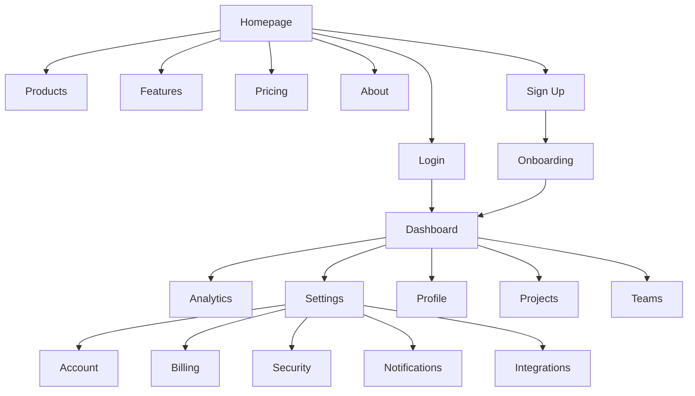

# ProtoThrive Interaction Map
## Complete User Flow & Component Interaction Documentation

**Generated:** September 25, 2025  
**Status:** Specification (Current app non-functional)  
**Purpose:** Define all interactive elements and user journeys

---

## Site Architecture & Navigation Flow



---

## Page-Level Interaction Maps

### 1. Homepage Interactions

```yaml
Homepage:
  URL: /
  Load_Time_Target: <2s
  
  Components:
    Header:
      - Logo: 
          action: click
          result: navigate_to_home
          selector: .logo
      - Navigation_Menu:
          items:
            - Products: 
                action: click/hover
                result: show_dropdown_or_navigate
            - Features: 
                action: click
                result: navigate_to_features
            - Pricing: 
                action: click
                result: navigate_to_pricing
            - About: 
                action: click
                result: navigate_to_about
      - CTA_Buttons:
          - Login:
              action: click
              result: navigate_to_login
              selector: .btn-login
          - Sign_Up:
              action: click
              result: open_signup_modal
              selector: .btn-signup
    
    Hero_Section:
      - Primary_CTA:
          text: "Get Started Free"
          action: click
          result: open_signup_modal
          selector: .hero-cta-primary
      - Secondary_CTA:
          text: "Watch Demo"
          action: click
          result: open_video_modal
          selector: .hero-cta-secondary
      - Video_Background:
          action: autoplay
          controls: pause/play on_click
    
    Features_Grid:
      - Feature_Card:
          count: 6
          actions:
            - hover: show_expanded_description
            - click: navigate_to_feature_detail
      - Learn_More_Links:
          action: click
          result: navigate_to_features
    
    Testimonial_Carousel:
      - Navigation_Arrows:
          - Previous:
              action: click
              result: show_previous_testimonial
          - Next:
              action: click
              result: show_next_testimonial
      - Pagination_Dots:
          action: click
          result: jump_to_testimonial
      - Auto_Advance:
          interval: 5000ms
          pause_on_hover: true
    
    Pricing_Preview:
      - Plan_Cards:
          count: 3
          actions:
            - hover: highlight_plan
            - click_select: open_signup_with_plan
      - Compare_Features:
          action: click
          result: expand_comparison_table
    
    Newsletter_Signup:
      - Email_Input:
          validation: on_blur
          error_display: inline
      - Submit_Button:
          action: click
          result: submit_newsletter
          loading_state: show_spinner
          success_state: show_confirmation
    
    Footer:
      - Links_Grid:
          sections: [Product, Company, Resources, Legal]
          action: click
          result: navigate_to_page
      - Social_Icons:
          platforms: [Twitter, LinkedIn, GitHub, YouTube]
          action: click
          result: open_in_new_tab
      - Language_Selector:
          action: click
          result: show_language_dropdown
```

### 2. Authentication Flow Interactions

```yaml
Login_Page:
  URL: /login
  
  Form_Elements:
    Email_Input:
      - type: email
      - validation: on_blur
      - error_states:
          - empty: "Email is required"
          - invalid: "Enter a valid email"
    
    Password_Input:
      - type: password
      - validation: on_submit
      - show_password_toggle:
          action: click
          result: toggle_password_visibility
    
    Remember_Me_Checkbox:
      - action: click
      - result: toggle_remember_state
    
    Submit_Button:
      - action: click
      - validation: all_fields
      - states:
          - default: "Sign In"
          - loading: show_spinner
          - success: redirect_to_dashboard
          - error: show_error_message
    
    Forgot_Password_Link:
      - action: click
      - result: navigate_to_password_reset
    
    Sign_Up_Link:
      - action: click
      - result: navigate_to_signup
    
    SSO_Buttons:
      - Google:
          action: click
          result: initiate_google_oauth
      - GitHub:
          action: click
          result: initiate_github_oauth
      - Microsoft:
          action: click
          result: initiate_microsoft_oauth

Sign_Up_Page:
  URL: /signup
  
  Multi_Step_Form:
    Step_1_Account:
      - Email_Input: 
          validation: async_check_availability
      - Password_Input:
          strength_meter: show_on_input
          requirements_list: update_on_input
      - Terms_Checkbox:
          required: true
      - Continue_Button:
          action: click
          result: validate_and_next_step
    
    Step_2_Profile:
      - First_Name_Input: required
      - Last_Name_Input: required
      - Company_Input: optional
      - Role_Select: 
          options: [Developer, Designer, Manager, Other]
      - Continue_Button:
          action: click
          result: validate_and_next_step
    
    Step_3_Preferences:
      - Use_Case_Select: multi_select
      - Team_Size_Radio: single_select
      - Newsletter_Checkbox: default_checked
      - Complete_Button:
          action: click
          result: create_account_and_redirect
    
    Progress_Indicator:
      - shows: current_step
      - clickable: completed_steps_only
```

### 3. Dashboard Interactions

```yaml
Dashboard:
  URL: /dashboard
  
  Top_Navigation:
    Search_Bar:
      - action: focus
      - result: show_search_suggestions
      - on_type: filter_suggestions
      - on_select: navigate_to_result
    
    Notifications_Bell:
      - action: click
      - result: toggle_notifications_dropdown
      - badge: show_unread_count
    
    User_Menu:
      - action: click
      - result: show_user_dropdown
      - menu_items:
          - Profile: navigate_to_profile
          - Settings: navigate_to_settings
          - Help: open_help_center
          - Logout: confirm_and_logout
  
  Sidebar_Navigation:
    Collapse_Toggle:
      - action: click
      - result: toggle_sidebar_width
      - persist: local_storage
    
    Menu_Items:
      - Overview:
          icon: home
          action: click
          result: show_overview
      - Projects:
          icon: folder
          action: click
          result: show_projects_list
          submenu:
            - All_Projects: filter_all
            - Recent: filter_recent
            - Archived: filter_archived
      - Analytics:
          icon: chart
          action: click
          result: show_analytics
      - Teams:
          icon: users
          action: click
          result: show_teams
      - Settings:
          icon: cog
          action: click
          result: navigate_to_settings
  
  Main_Content_Area:
    Stats_Cards:
      - count: 4
      - refresh_interval: 30000ms
      - hover: show_tooltip
      - click: drill_down_to_details
    
    Charts:
      - Line_Chart:
          interactions:
            - hover: show_data_point
            - click: filter_by_point
            - zoom: scroll_or_pinch
      - Bar_Chart:
          interactions:
            - hover: show_value
            - click: filter_by_bar
      - Pie_Chart:
          interactions:
            - hover: show_percentage
            - click: filter_by_segment
    
    Data_Table:
      - Sort_Headers:
          action: click
          result: sort_by_column
      - Row_Actions:
          - View: open_detail_modal
          - Edit: open_edit_modal
          - Delete: confirm_and_delete
      - Bulk_Actions:
          - Select_All: toggle_all_checkboxes
          - Bulk_Delete: confirm_and_delete_selected
          - Export: download_csv
      - Pagination:
          - Previous: load_previous_page
          - Next: load_next_page
          - Page_Number: jump_to_page
          - Items_Per_Page: change_page_size
    
    Quick_Actions_FAB:
      - action: click
      - result: show_quick_action_menu
      - menu_items:
          - New_Project: open_create_modal
          - Import_Data: open_import_dialog
          - Generate_Report: start_report_generation
```

### 4. Modal Interactions

```yaml
Modals:
  Sign_Up_Modal:
    trigger: .btn-signup, .cta-signup
    behaviors:
      - backdrop: 
          click: close_modal
          opacity: 0.5
      - close_button:
          action: click
          result: close_modal
      - escape_key: close_modal
      - focus_trap: enabled
      - animation: fade_and_scale
    
  Video_Modal:
    trigger: .btn-watch-demo
    behaviors:
      - auto_play: true
      - pause_on_close: true
      - fullscreen_toggle: available
      - playback_controls: visible
  
  Confirmation_Modal:
    trigger: destructive_actions
    behaviors:
      - primary_button:
          text: "Confirm"
          action: execute_action
      - secondary_button:
          text: "Cancel"
          action: close_modal
      - escape_key: close_modal
  
  Edit_Modal:
    trigger: .btn-edit
    behaviors:
      - form_validation: on_submit
      - save_button:
          states: [default, loading, success, error]
      - cancel_button: discard_and_close
      - unsaved_changes_warning: on_close_attempt
```

### 5. Form Interactions

```yaml
Form_Patterns:
  Text_Input:
    events:
      - focus: highlight_field
      - blur: validate_if_dirty
      - input: update_character_count
      - paste: sanitize_input
    states:
      - default: gray_border
      - focus: blue_border
      - error: red_border
      - success: green_border
      - disabled: gray_background
  
  Select_Dropdown:
    events:
      - click: toggle_options
      - keydown:
          - arrow_up: previous_option
          - arrow_down: next_option
          - enter: select_option
          - escape: close_dropdown
      - type: filter_options
    behaviors:
      - search: filter_as_you_type
      - multi_select: show_checkboxes
      - clear: show_clear_button
  
  Checkbox_Radio:
    events:
      - click: toggle_state
      - space: toggle_state
      - tab: move_focus
    states:
      - unchecked: empty_box
      - checked: show_checkmark
      - indeterminate: show_dash
      - disabled: gray_out
  
  File_Upload:
    events:
      - click: open_file_dialog
      - drag_enter: highlight_drop_zone
      - drag_over: show_drop_message
      - drop: process_files
      - drag_leave: remove_highlight
    validations:
      - file_type: check_mime_type
      - file_size: check_max_size
      - file_count: check_max_files
    feedback:
      - uploading: progress_bar
      - success: green_checkmark
      - error: red_x_with_message
  
  Date_Picker:
    events:
      - click: open_calendar
      - select_date: update_input
      - navigate_month: update_calendar
      - type: parse_date
    features:
      - range_selection: enabled
      - disabled_dates: weekends
      - min_max_dates: configured
      - time_picker: optional
```

### 6. Navigation Interactions

```yaml
Navigation_Patterns:
  Mega_Menu:
    trigger: hover_or_click
    structure:
      - columns: 4
      - sections: [Products, Solutions, Resources, Company]
    behaviors:
      - hover_delay: 200ms
      - close_delay: 300ms
      - keyboard_navigation: arrow_keys
      - escape_key: close_menu
  
  Breadcrumbs:
    structure:
      - separator: "/"
      - max_items: 5
      - overflow: ellipsis
    interactions:
      - click: navigate_to_level
      - hover: show_full_path
  
  Tabs:
    types:
      - horizontal: default
      - vertical: sidebar_style
      - pills: rounded_buttons
    behaviors:
      - click: switch_tab
      - keyboard:
          - arrow_left: previous_tab
          - arrow_right: next_tab
          - home: first_tab
          - end: last_tab
      - swipe: mobile_gesture
    states:
      - active: highlighted
      - inactive: muted
      - disabled: grayed_out
  
  Pagination:
    elements:
      - first: jump_to_start
      - previous: go_back
      - numbers: jump_to_page
      - next: go_forward
      - last: jump_to_end
    configurations:
      - items_per_page: [10, 25, 50, 100]
      - max_visible_pages: 7
      - show_ellipsis: true
```

### 7. Gesture & Touch Interactions (Mobile)

```yaml
Mobile_Interactions:
  Touch_Gestures:
    Swipe:
      - left: next_item
      - right: previous_item
      - up: scroll_down
      - down: refresh
    
    Pinch:
      - in: zoom_out
      - out: zoom_in
    
    Long_Press:
      - duration: 500ms
      - result: show_context_menu
    
    Double_Tap:
      - result: zoom_to_element
  
  Mobile_Specific:
    Hamburger_Menu:
      - tap: toggle_mobile_menu
      - swipe_left: close_menu
      - backdrop_tap: close_menu
    
    Bottom_Navigation:
      - items: 5_max
      - active_indicator: color_and_icon
      - tap: switch_section
    
    Pull_to_Refresh:
      - threshold: 100px
      - indicator: spinning_arrow
      - release: trigger_refresh
    
    Floating_Action_Button:
      - position: bottom_right
      - tap: show_quick_actions
      - drag: reposition
```

## Interaction States & Feedback

### Visual Feedback Patterns

```yaml
Hover_States:
  Buttons:
    - background: darken_10%
    - shadow: elevate
    - cursor: pointer
  
  Links:
    - text_decoration: underline
    - color: darken_20%
    - cursor: pointer
  
  Cards:
    - shadow: elevate
    - transform: scale(1.02)
    - transition: 200ms_ease

Focus_States:
  Keyboard_Focus:
    - outline: 3px_solid_blue
    - outline_offset: 2px
    - no_outline_on_click: true
  
  Form_Fields:
    - border: 2px_solid_blue
    - shadow: 0_0_0_3px_rgba(blue,0.25)

Active_States:
  Buttons:
    - transform: scale(0.98)
    - shadow: inner
  
  Links:
    - color: darkest_variant

Loading_States:
  Buttons:
    - spinner: replace_text
    - disabled: true
    - cursor: not_allowed
  
  Content:
    - skeleton: animated_placeholder
    - progressive: load_as_available
  
  Page:
    - progress_bar: top_of_page
    - spinner: center_screen

Error_States:
  Forms:
    - border: red
    - message: below_field
    - icon: exclamation
    - shake: 300ms_animation
  
  Toasts:
    - background: red
    - icon: x_mark
    - position: top_right
    - auto_dismiss: 5000ms

Success_States:
  Forms:
    - border: green
    - icon: checkmark
    - message: "Saved successfully"
  
  Toasts:
    - background: green
    - icon: checkmark
    - position: top_right
    - auto_dismiss: 3000ms
```

## Keyboard Navigation Map

```yaml
Global_Shortcuts:
  "/": focus_search
  "?": show_help
  "g h": go_home
  "g d": go_dashboard
  "g s": go_settings
  "g p": go_profile
  "Escape": close_modal_or_dropdown
  "Ctrl+K" or "Cmd+K": command_palette

Tab_Order:
  1: skip_navigation_link
  2: logo
  3: main_navigation_items
  4: search_bar
  5: user_menu
  6: main_content
  7: sidebar_navigation
  8: footer_links

Modal_Navigation:
  Tab: next_focusable_element
  Shift+Tab: previous_focusable_element
  Escape: close_modal
  Enter: submit_or_confirm
  Space: toggle_checkbox_or_button

Form_Navigation:
  Tab: next_field
  Shift+Tab: previous_field
  Enter: submit_form_or_next_step
  Space: toggle_checkbox_or_select
  Arrow_Keys: navigate_select_options
```

## Analytics Event Tracking

```yaml
Page_Events:
  page_view:
    - page_name: string
    - page_path: string
    - referrer: string
    - timestamp: number

User_Events:
  sign_up:
    - method: email|google|github
    - plan: free|pro|enterprise
    - source: organic|paid|referral
  
  login:
    - method: email|sso
    - remember_me: boolean
  
  logout:
    - session_duration: number

Interaction_Events:
  button_click:
    - button_text: string
    - button_location: string
    - destination: string
  
  link_click:
    - link_text: string
    - link_url: string
    - is_external: boolean
  
  form_submit:
    - form_name: string
    - success: boolean
    - error_message: string
  
  search:
    - query: string
    - results_count: number
    - selected_result: string

Engagement_Events:
  video_play:
    - video_id: string
    - duration_watched: number
    - completion_rate: percentage
  
  scroll_depth:
    - depth_percentage: 25|50|75|100
    - page: string
  
  time_on_page:
    - page: string
    - duration: seconds
```

## Error Handling & Recovery

```yaml
Error_Scenarios:
  Network_Error:
    - display: "Connection lost" toast
    - action: retry_button
    - auto_retry: after_5_seconds
  
  Form_Validation_Error:
    - display: inline_error_message
    - focus: first_error_field
    - scroll: to_error_if_offscreen
  
  404_Not_Found:
    - display: custom_404_page
    - suggestions: similar_pages
    - action: go_home_button
  
  500_Server_Error:
    - display: error_boundary
    - message: "Something went wrong"
    - action: reload_or_go_home
    - log: send_to_error_tracking
  
  Session_Expired:
    - display: modal_notification
    - action: redirect_to_login
    - preserve: form_data_in_session_storage
  
  Permission_Denied:
    - display: "Access denied" message
    - action: request_access_button
    - redirect: to_allowed_page
```

## Performance Optimization Points

```yaml
Lazy_Loading:
  Images:
    - below_fold: load_on_scroll
    - threshold: 200px_before_viewport
  
  Components:
    - routes: code_split
    - modals: load_on_demand
    - heavy_features: load_on_interaction
  
  Data:
    - pagination: load_page_on_demand
    - infinite_scroll: load_next_batch
    - search_results: debounced_fetch

Caching:
  Static_Assets:
    - images: cache_1_year
    - css: cache_1_year_with_hash
    - js: cache_1_year_with_hash
  
  API_Responses:
    - user_data: cache_5_minutes
    - static_lists: cache_1_hour
    - real_time_data: no_cache

Optimistic_Updates:
  Form_Submit:
    - update_ui: immediately
    - confirm: on_success
    - rollback: on_error
  
  Like_Toggle:
    - update_count: immediately
    - sync: in_background
```

---

## Testing Checklist for Interactions

```yaml
Functional_Tests:
  ✓ All_buttons_clickable
  ✓ All_links_navigate_correctly
  ✓ Forms_validate_properly
  ✓ Modals_open_and_close
  ✓ Dropdowns_function
  ✓ Search_returns_results
  ✓ Pagination_works
  ✓ Filters_apply_correctly

Accessibility_Tests:
  ✓ Keyboard_navigation_complete
  ✓ Screen_reader_compatible
  ✓ Focus_indicators_visible
  ✓ ARIA_labels_present
  ✓ Color_contrast_sufficient
  ✓ Touch_targets_44px_minimum

Performance_Tests:
  ✓ Interactions_respond_within_100ms
  ✓ Animations_run_at_60fps
  ✓ No_layout_shifts_on_interaction
  ✓ Lazy_loading_triggers_correctly

Cross_Browser_Tests:
  ✓ Chrome_latest
  ✓ Firefox_latest
  ✓ Safari_latest
  ✓ Edge_latest
  ✓ Mobile_Safari
  ✓ Chrome_Android
```

---

**End of Interaction Map**

This document serves as the complete reference for all user interactions in the ProtoThrive application. Each interaction should be implemented with appropriate feedback, accessibility features, and performance optimizations as specified.
