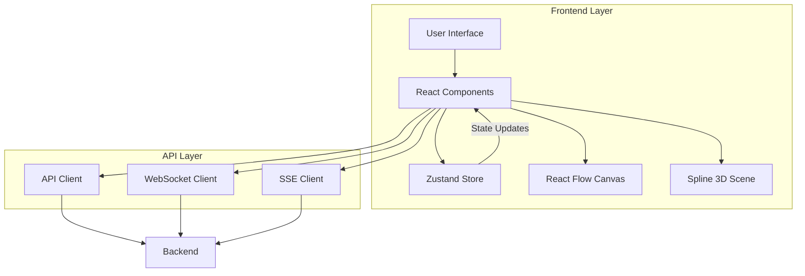
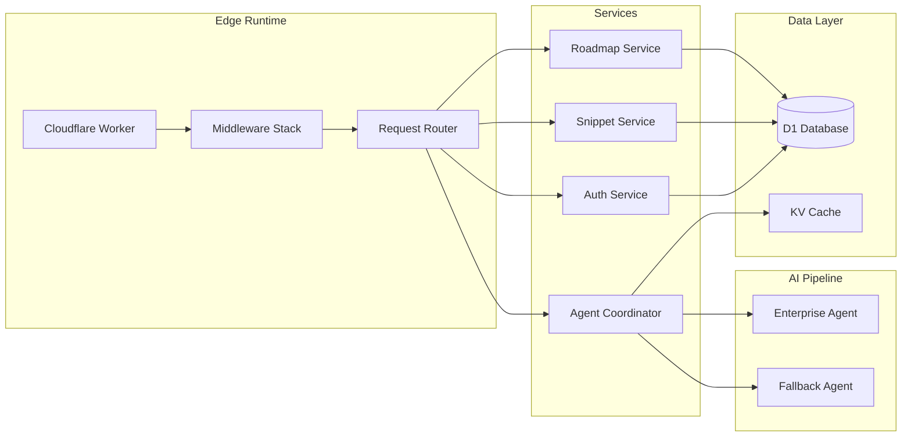
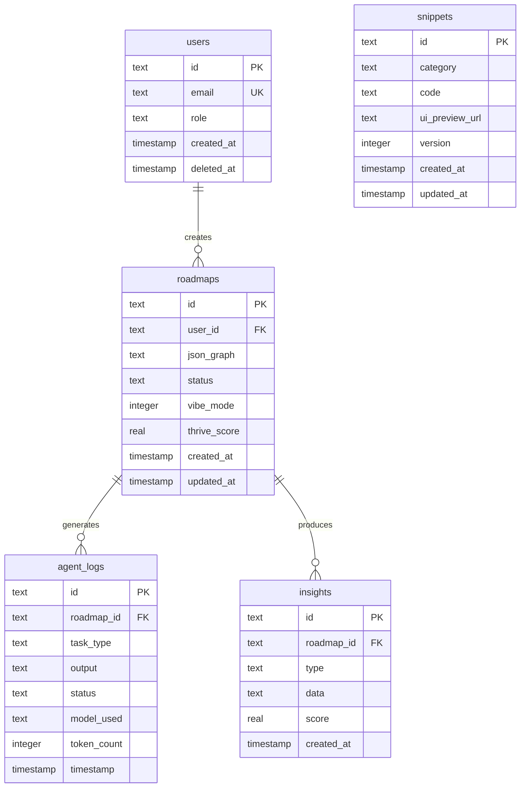
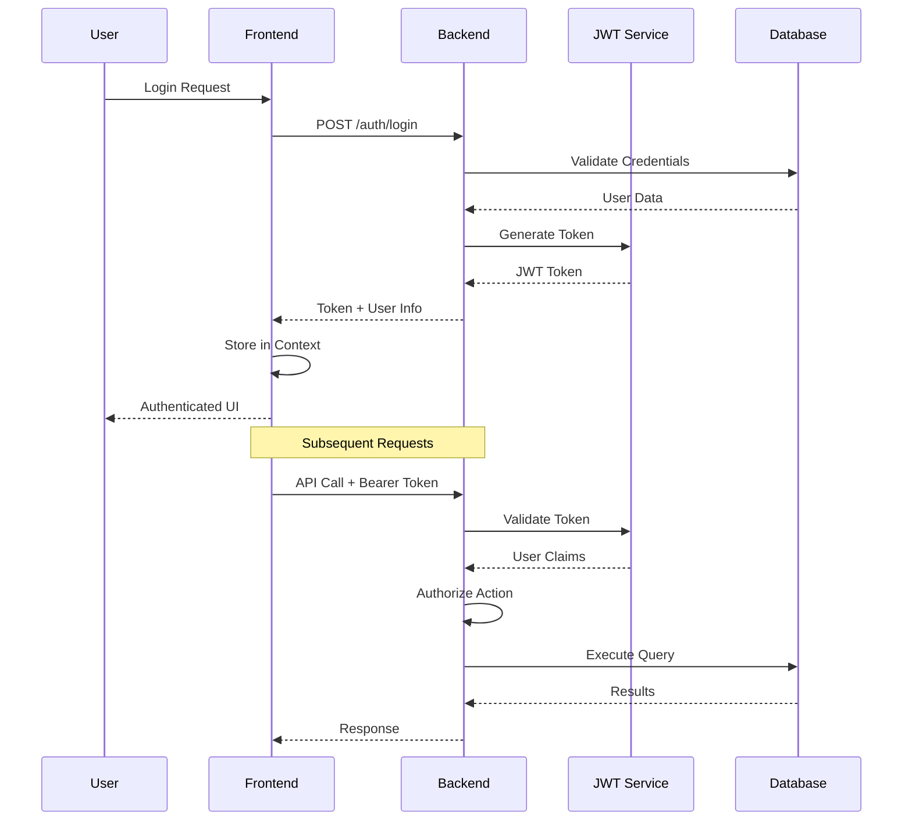
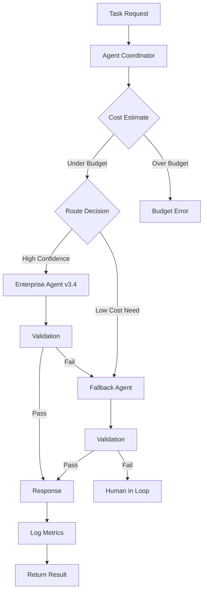
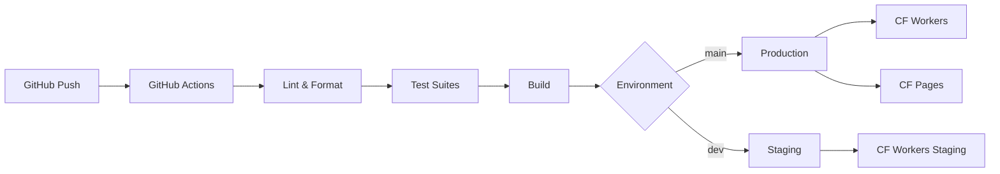
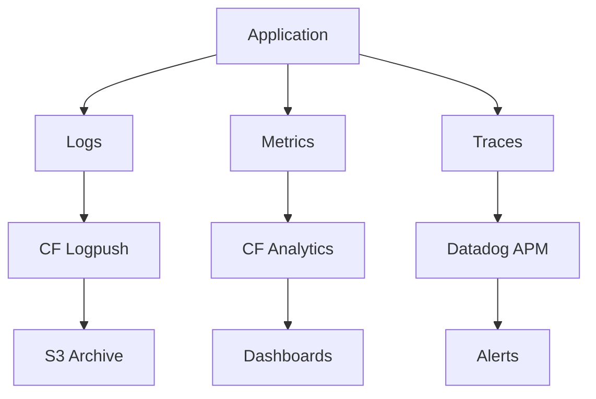

# Architecture Overview - ProtoThrive2

## System Design Philosophy
ProtoThrive follows a "Thermonuclear" architecture pattern emphasizing:
- Cost-aware AI orchestration ($0.10/task budget)
- Mock-first development with production toggles
- Edge-first deployment on Cloudflare infrastructure
- Multi-agent ensemble with fallback strategies

## Component Architecture

### Frontend Architecture

### Backend Architecture

## Data Architecture

### Database Schema (D1)

## Security Architecture

### Authentication Flow

## Agent Orchestration

### Dual-Agent Pipeline

### Agent Configuration
- **Primary**: Enterprise Agent v3.4
  - Models: GPT-5 Codex, Claude Opus 4
  - Confidence threshold: 0.8
  - Budget: $0.40 default, $1.00 max

- **Fallback**: Lightweight Python Agent
  - Models: Local orchestrator
  - Budget: $0.05 minimum
  - Use case: Simple tasks, budget constraints

## Deployment Architecture

### CI/CD Pipeline

### Infrastructure
- **Edge Locations**: Cloudflare's 300+ PoPs
- **Database**: D1 with automatic replication
- **Cache**: KV with 60s TTL default
- **Static Assets**: Cloudflare Pages CDN

## Performance Architecture

### Optimization Strategies
1. **Edge Computing**: All logic at Cloudflare edge
2. **Database Indexing**: Composite indexes on hot paths
3. **Caching**: KV for agent results, user sessions
4. **Code Splitting**: Dynamic imports in frontend
5. **Asset Optimization**: WebP images, minified JS/CSS

### SLO Targets
- API Response: < 200ms p95
- Page Load: < 2s LCP
- Agent Response: < 5s for simple tasks
- Availability: 99.9% uptime

## Scalability Design

### Horizontal Scaling
- Cloudflare Workers: Auto-scales to millions of requests
- D1 Database: Read replicas across regions
- KV Cache: Globally distributed

### Vertical Scaling
- Worker CPU: 50ms - 50s limits
- Memory: 128MB per worker
- Database: 500GB D1 storage limit

## Monitoring & Observability

### Metrics Collection

### Key Metrics
- Request latency (p50, p95, p99)
- Error rates by endpoint
- Agent cost per task
- Database query performance
- Cache hit rates

## Disaster Recovery

### Backup Strategy
- Database: Daily D1 backups
- Code: Git repository (GitHub)
- Configurations: Version controlled
- Secrets: Cloudflare encrypted storage

### Recovery Procedures
1. Database corruption: Restore from D1 backup
2. Service outage: Cloudflare automatic failover
3. Code regression: Git revert + redeploy
4. Data loss: Point-in-time recovery from backups