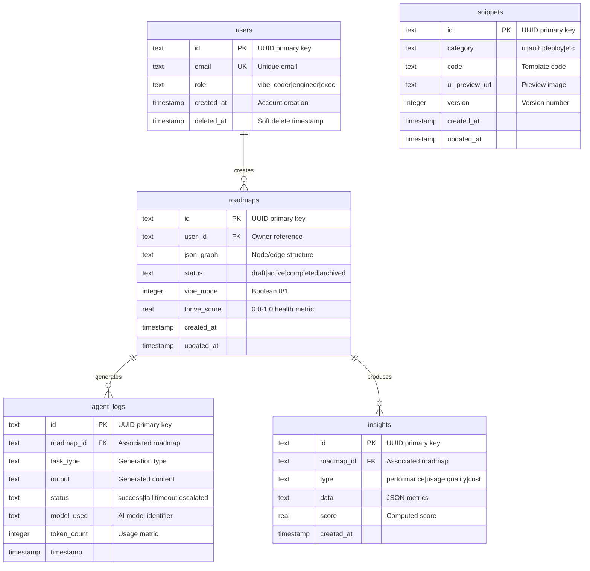
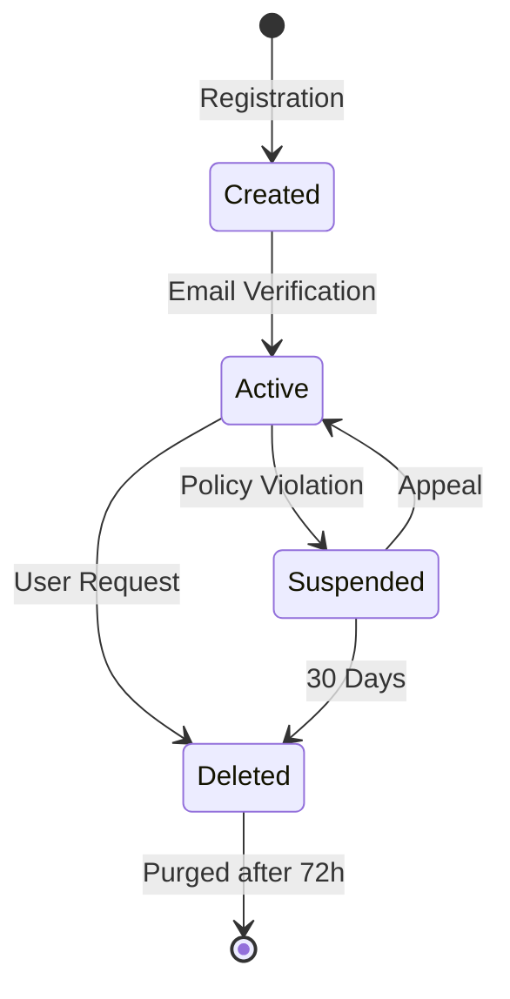
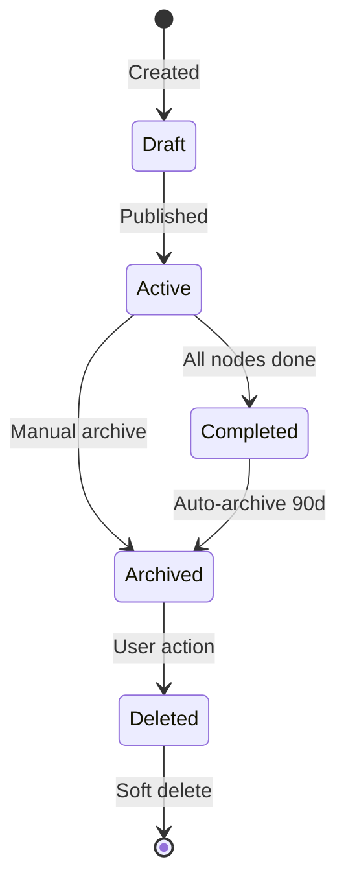
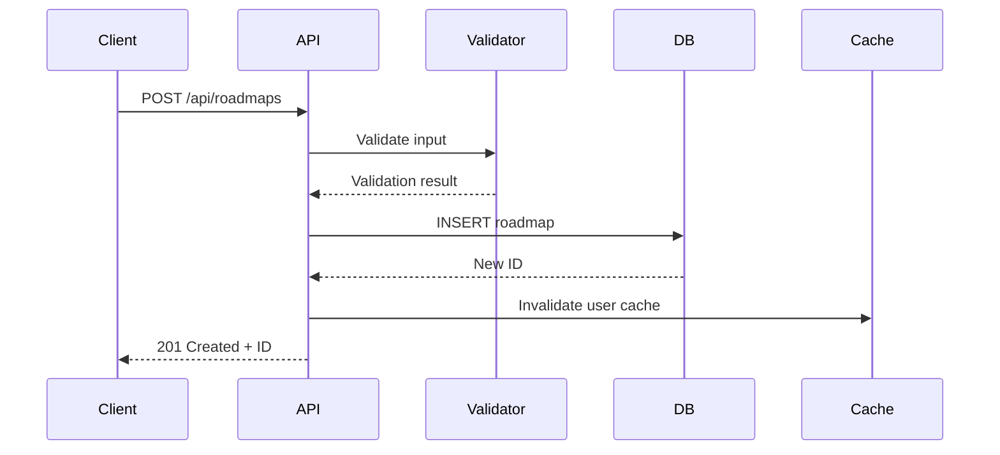
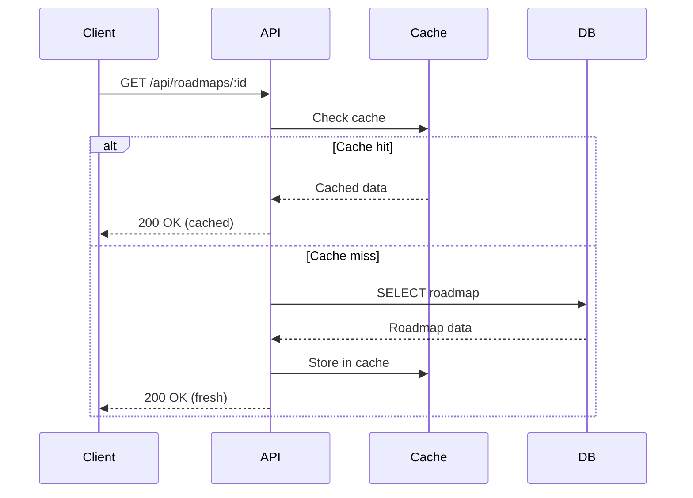
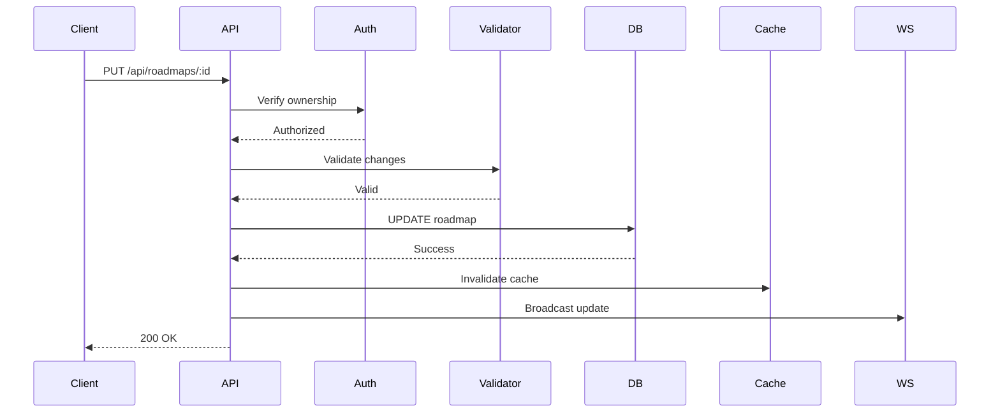
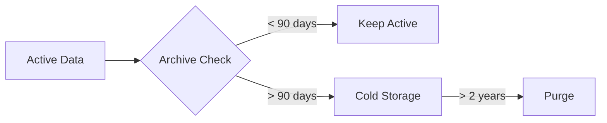

# Data Model & Flow - ProtoThrive2

## Database Architecture
**Type**: Cloudflare D1 (SQLite-based)
**Location**: Global edge deployment
**Backup**: Daily automatic backups

## Entity Relationship Model



## Indexing Strategy

### Primary Indexes
- `users.email` - Unique index for authentication
- `roadmaps.user_id` - User roadmap queries
- `roadmaps.status` - Status filtering
- `snippets.category` - Category browsing
- `agent_logs.roadmap_id` - Log retrieval

### Composite Indexes
- `roadmaps(user_id, status, updated_at)` - User dashboard queries
- `agent_logs(roadmap_id, status, timestamp)` - Activity tracking
- `insights(roadmap_id, type, created_at)` - Analytics queries

## Data Lifecycle

### User Lifecycle


### Roadmap Lifecycle


## JSON Graph Structure

### Roadmap Graph Schema
```json
{
  "nodes": [
    {
      "id": "n1",
      "label": "Milestone Name",
      "status": "gray|neon",
      "position": {
        "x": 0,
        "y": 0,
        "z": 0
      },
      "metadata": {
        "description": "Details",
        "assignee": "user_id",
        "due_date": "2025-10-01",
        "tags": ["backend", "critical"]
      }
    }
  ],
  "edges": [
    {
      "from": "n1",
      "to": "n2",
      "type": "dependency|parallel",
      "label": "Connection description"
    }
  ],
  "metadata": {
    "version": "1.0",
    "created_by": "user_id",
    "last_modified": "2025-09-22T00:00:00Z"
  }
}
```

## Data Flow Patterns

### Create Operation Flow


### Read Operation Flow


### Update Operation Flow


## Caching Strategy

### KV Cache Structure
```
Key Pattern: {entity}:{id}:{version}
TTL: 60 seconds default, 300 seconds for static content

Examples:
- roadmap:uuid-123:v1 → Roadmap JSON
- user:uuid-456:profile → User profile
- snippets:ui:list → Category listing
```

### Cache Invalidation
1. Write-through on updates
2. TTL-based expiration
3. Manual purge on critical changes
4. Broadcast invalidation via WebSocket

## Data Migration Strategy

### Migration Files
```
migrations/
  001_init.sql           - Initial schema
  002_add_insights.sql   - Analytics tables
  003_add_2fa.sql       - Two-factor auth
  004_enterprise.sql     - Enterprise features
```

### Migration Process
1. Test in development D1
2. Apply to staging
3. Validate with smoke tests
4. Apply to production during maintenance
5. Verify and rollback if needed

## Data Retention Policies

### Retention Periods
- **User Data**: Indefinite while active
- **Roadmaps**: 2 years after last update
- **Agent Logs**: 90 days
- **Insights**: 1 year
- **Audit Logs**: 7 years (compliance)

### Archival Strategy


## Backup & Recovery

### Backup Schedule
- **Full Backup**: Daily at 02:00 UTC
- **Incremental**: Every 6 hours
- **Retention**: 30 days rolling

### Recovery Procedures
1. **Point-in-time Recovery**: Last 30 days
2. **Disaster Recovery**: Cross-region replication
3. **RTO**: 4 hours
4. **RPO**: 6 hours

## Data Security

### Encryption
- **At Rest**: D1 automatic encryption
- **In Transit**: TLS 1.3
- **Sensitive Fields**: Application-level encryption for PII

### Access Controls
- Row-level security via user_id filtering
- API-level authorization checks
- Database connection via Worker bindings only

## Performance Optimizations

### Query Optimization
```sql
-- Optimized user roadmaps query
SELECT id, json_graph, status, thrive_score
FROM roadmaps
WHERE user_id = ?
  AND status IN ('draft', 'active')
ORDER BY updated_at DESC
LIMIT 10 OFFSET ?;
-- Uses composite index: idx_roadmaps_composite
```

### Batch Operations
```javascript
// Batch insert for agent logs
const batchInsert = async (logs) => {
  const stmt = db.prepare(`
    INSERT INTO agent_logs
    (roadmap_id, task_type, output, status, model_used, token_count)
    VALUES (?, ?, ?, ?, ?, ?)
  `);

  const batch = logs.map(log =>
    stmt.bind(log.roadmap_id, log.task_type, log.output,
             log.status, log.model_used, log.token_count)
  );

  await db.batch(batch);
};
```

## Monitoring Queries

### Health Check
```sql
SELECT
  COUNT(*) as total_roadmaps,
  AVG(thrive_score) as avg_score,
  COUNT(DISTINCT user_id) as active_users
FROM roadmaps
WHERE updated_at > datetime('now', '-7 days');
```

### Performance Metrics
```sql
SELECT
  model_used,
  AVG(token_count) as avg_tokens,
  COUNT(*) as task_count,
  SUM(CASE WHEN status = 'success' THEN 1 ELSE 0 END) / COUNT(*) as success_rate
FROM agent_logs
WHERE timestamp > datetime('now', '-1 day')
GROUP BY model_used;
```