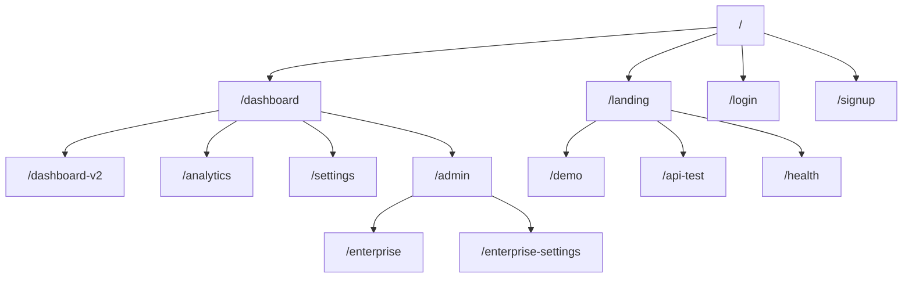
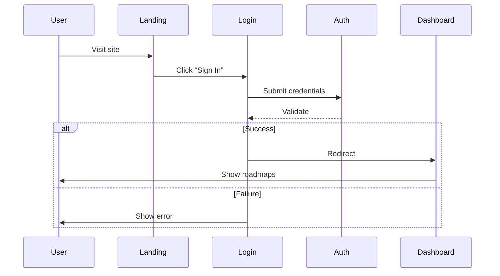
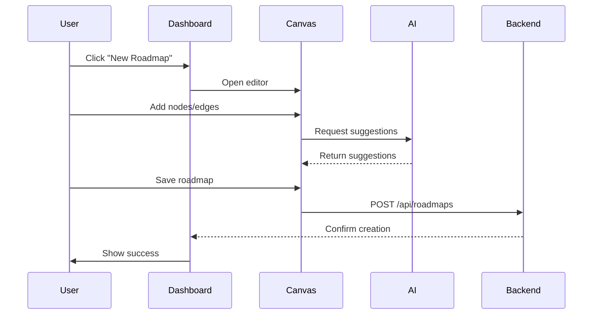

# UX Surface Map - ProtoThrive2

## Page Hierarchy



## Primary User Flows

### Authentication Flow


### Roadmap Creation Flow


## Component Inventory

### Core Pages

#### Landing Page (`/landing`)
- **Components**: Hero, Features, CTAs
- **Purpose**: Marketing and onboarding
- **State**: Rebuilt version available
- **File**: frontend/src/pages/landing.tsx

#### Dashboard (`/dashboard-rebuilt`)
- **Components**: MagicCanvas, InsightsPanel, Sidebar
- **Purpose**: Main workspace
- **Features**: 2D/3D toggle, real-time updates
- **File**: frontend/src/pages/dashboard-rebuilt.tsx

#### Login (`/login`)
- **Components**: LoginForm, OAuthButtons
- **Purpose**: User authentication
- **Issues**: TypeScript compilation errors
- **File**: frontend/src/pages/login.tsx

#### Signup (`/signup`)
- **Components**: SignupForm, OAuthButtons
- **Purpose**: User registration
- **Issues**: TypeScript compilation errors
- **File**: frontend/src/pages/signup.tsx

### Feature Components

#### MagicCanvas
- **Location**: frontend/src/components/MagicCanvas.tsx
- **Features**:
  - 2D React Flow visualization
  - 3D Spline integration
  - Node/edge manipulation
  - Real-time collaboration cursors

#### InsightsPanel
- **Location**: frontend/src/components/InsightsPanel.tsx
- **Features**:
  - Thrive Score display
  - Progress metrics
  - AI predictions
  - Historical trends

#### AIVisionInput
- **Location**: frontend/src/components/AIVisionInput.tsx
- **Features**:
  - Image upload
  - Diagram parsing
  - Requirement extraction

#### AdminDashboard
- **Location**: frontend/src/components/AdminDashboard.tsx
- **Features**:
  - User management
  - System metrics
  - Configuration controls

### UI Components Library

#### Elite Components
- EliteButton.tsx - Premium styled button
- EliteCard.tsx - Card with neon effects
- EliteInput.tsx - Styled input field
- EliteSidebar.tsx - Navigation sidebar

#### Collaboration Components
- CollaborationProvider.tsx - WebSocket context
- RealTimeCollaboration.tsx - Live editing
- PresenceIndicator.tsx - Active users

#### Analytics Components
- ThriveScoreAnalytics.tsx - Score visualization
- AnalyticsDashboard.tsx - Metrics overview
- SmartProgressTracker.tsx - Progress tracking

## User Interface States

### Loading States
```typescript
// Consistent loading pattern
<div className="flex items-center justify-center min-h-screen">
  <div className="animate-spin rounded-full h-12 w-12 border-t-2 border-blue-500" />
  <span className="ml-3">Loading ProtoThrive...</span>
</div>
```

### Error States
```typescript
// Error boundary component
<ErrorBoundary>
  <div className="bg-red-50 p-4 rounded">
    <h3 className="text-red-800">Something went wrong</h3>
    <p className="text-red-600">{error.message}</p>
    <button onClick={retry}>Try Again</button>
  </div>
</ErrorBoundary>
```

### Empty States
```typescript
// No data placeholder
<div className="text-center py-12">
  <Icon className="mx-auto h-12 w-12 text-gray-400" />
  <h3 className="mt-2 text-sm font-medium">No roadmaps yet</h3>
  <p className="mt-1 text-sm text-gray-500">
    Get started by creating a new roadmap
  </p>
  <button className="mt-5">Create Roadmap</button>
</div>
```

## Design System

### Color Palette
```css
:root {
  --primary: #00d2ff;      /* Neon blue */
  --secondary: #ff6b35;    /* Orange accent */
  --background: #0a0a0b;   /* Dark background */
  --surface: #1a1a1b;      /* Card background */
  --text-primary: #ffffff;  /* Primary text */
  --text-secondary: #a0a0a0; /* Secondary text */
  --success: #00ff88;      /* Success green */
  --error: #ff3333;        /* Error red */
  --warning: #ffaa00;      /* Warning yellow */
}
```

### Typography
```css
/* Font stack */
font-family: 'Inter', system-ui, -apple-system, sans-serif;

/* Type scale */
.text-xs: 0.75rem;
.text-sm: 0.875rem;
.text-base: 1rem;
.text-lg: 1.125rem;
.text-xl: 1.25rem;
.text-2xl: 1.5rem;
.text-3xl: 1.875rem;
.text-4xl: 2.25rem;
```

### Spacing System
```css
/* Spacing scale (Tailwind) */
spacing: {
  0: 0,
  1: 0.25rem,
  2: 0.5rem,
  3: 0.75rem,
  4: 1rem,
  6: 1.5rem,
  8: 2rem,
  12: 3rem,
  16: 4rem,
  24: 6rem
}
```

## Responsive Design

### Breakpoints
```css
/* Tailwind breakpoints */
sm: 640px   /* Mobile landscape */
md: 768px   /* Tablet */
lg: 1024px  /* Desktop */
xl: 1280px  /* Large desktop */
2xl: 1536px /* Extra large */
```

### Mobile Adaptations
- Hamburger menu for navigation
- Stacked layout for dashboard
- Touch-optimized controls
- Swipe gestures for canvas

## Interaction Patterns

### Drag and Drop
- Nodes in canvas
- Reordering in lists
- File uploads

### Keyboard Shortcuts
```javascript
const shortcuts = {
  'cmd+s': 'Save',
  'cmd+z': 'Undo',
  'cmd+shift+z': 'Redo',
  'cmd+k': 'Quick search',
  'esc': 'Close modal',
  '2': 'Toggle 2D mode',
  '3': 'Toggle 3D mode'
};
```

### Gestures
- Pinch to zoom (canvas)
- Pan to navigate
- Long press for context menu
- Swipe to dismiss

## Accessibility Features

### Current Implementation
- Basic ARIA labels
- Keyboard navigation (partial)
- Focus management (partial)
- Color contrast (needs work)

### Missing Features
- Screen reader announcements
- Skip navigation links
- Landmark regions
- Focus indicators
- High contrast mode

## Animation & Transitions

### Motion Principles
```css
/* Consistent timing functions */
.transition-all {
  transition-timing-function: cubic-bezier(0.4, 0, 0.2, 1);
  transition-duration: 200ms;
}

/* Reduced motion support */
@media (prefers-reduced-motion: reduce) {
  * {
    animation-duration: 0.01ms !important;
    transition-duration: 0.01ms !important;
  }
}
```

### Common Animations
- Fade in/out for modals
- Slide for sidebars
- Scale for buttons
- Rotate for loading spinners
- Glow for neon effects

## Content Strategy

### Microcopy Guidelines
- Clear, action-oriented CTAs
- Helpful error messages
- Contextual tooltips
- Progress indicators
- Success confirmations

### Localization
- Currently English only
- i18n structure not implemented
- Future support planned

## Feature Discovery

### Onboarding Flow
1. Welcome modal
2. Interactive tutorial
3. Tooltips for new features
4. Progress checklist
5. Help documentation

### Power User Features
- Command palette (cmd+k)
- Keyboard shortcuts
- Bulk operations
- Advanced filters
- Custom themes (planned)

## Navigation Structure

### Primary Navigation
- Logo/Home
- Dashboard
- Analytics
- Settings
- Profile menu

### Secondary Navigation
- Breadcrumbs
- Tab navigation
- Contextual actions
- Quick actions toolbar

### Footer
- Legal links
- Documentation
- Support
- Social media

## Modal & Overlay Patterns

### Modal Types
- Confirmation dialogs
- Forms (create/edit)
- Information displays
- Media viewers
- Error alerts

### Overlay Behaviors
- Click outside to close
- ESC key to dismiss
- Focus trap
- Scroll lock
- Transition animations

## Form Patterns

### Input Types
- Text fields with validation
- Select dropdowns
- Radio/checkbox groups
- File uploads
- Rich text editors
- Date/time pickers

### Validation
- Real-time validation
- Error messages below fields
- Success indicators
- Required field markers
- Help text/tooltips

## Performance Considerations

### Lazy Loading
- Route-based code splitting
- Component lazy loading
- Image lazy loading
- Virtual scrolling for lists

### Optimistic UI
- Immediate feedback
- Background sync
- Rollback on error
- Progress indicators