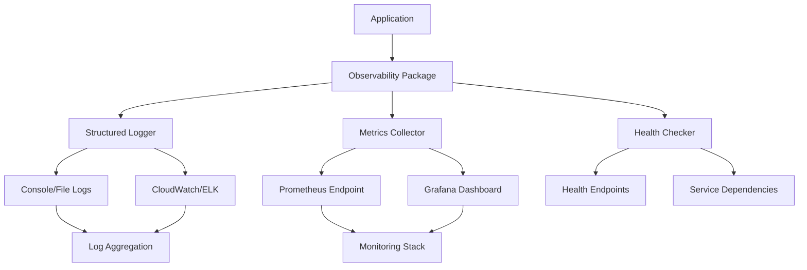

# ProtoThrive Observability Guide

Enterprise-grade observability implementation with structured logging, metrics collection, and health monitoring for ProtoThrive platform.

## Overview

This document describes the observability stack implemented for ProtoThrive, including:

- **Structured Logging**: Winston (Node.js) and Loguru (Python) with JSON output
- **Metrics Collection**: Prometheus-compatible metrics for monitoring
- **Health Checks**: Comprehensive service health monitoring
- **Error Tracking**: Centralized error handling and alerting

## Architecture



## Quick Start

### Node.js/TypeScript Setup

```typescript
import { Observability } from '@protothrive/observability';

// Initialize observability
const obs = Observability.initialize({
  serviceName: 'my-service',
  version: '1.0.0',
  environment: 'production'
});

// Use structured logging
obs.logger.info('Service started', { port: 3000 });
obs.logger.error('Database connection failed', error);

// Record metrics
obs.metrics?.recordHttpRequest('GET', '/api/users', 200, 150);
obs.metrics?.recordBusinessOperation('create_user', true);

// Check health
app.get('/health', obs.healthHandler.bind(obs));
app.get('/metrics', obs.metricsHandler.bind(obs));
```

### Python Setup

```python
from ai_core.logger import initialize_logger, get_logger

# Initialize logger
initialize_logger('my-ai-service', '1.0.0')
logger = get_logger()

# Use structured logging
logger.info('AI processing started', task_id='12345', model='gpt-4')
logger.error('Model inference failed', error=exception, task_id='12345')

# Log AI-specific metrics
logger.ai_inference(
    model='gpt-4',
    task_type='code_generation',
    prompt_tokens=100,
    completion_tokens=200,
    duration_ms=1500,
    cost_usd=0.003,
    success=True
)

# Performance monitoring
@logger.performance('data_processing')
def process_data(data):
    # Your processing logic
    return processed_data
```

## Configuration

### Environment Variables

Configure logging behavior using environment variables:

```bash
# Log Levels
LOG_LEVEL=info              # debug, info, warn, error
ENVIRONMENT=production      # development, staging, production

# Node.js specific
NODE_ENV=production

# Python specific
PYTHONPATH=./src
```

### Log Levels by Environment

| Environment | Node.js Level | Python Level | File Logging |
|-------------|---------------|--------------|--------------|
| development | debug         | DEBUG        | Console only |
| staging     | info          | INFO         | Files + Console |
| production  | info          | INFO         | Files + Console |
| test        | error         | ERROR        | Console only |

## Logging Standards

### Structured Log Format

All logs are output in JSON format for production environments:

```json
{
  "timestamp": "2024-01-15T10:30:45.123Z",
  "level": "info",
  "message": "Request completed",
  "service": "protothrive-backend",
  "environment": "production",
  "version": "2.0.0",
  "instance": "worker-1",
  "method": "POST",
  "path": "/api/roadmaps",
  "statusCode": 201,
  "duration": 150,
  "userId": "user-123",
  "requestId": "req-456"
}
```

### Development Format

Human-readable format for development:

```
[2024-01-15 10:30:45.123] [protothrive-backend] INFO: Request completed {"method":"POST","path":"/api/roadmaps","statusCode":201,"duration":150}
```

### Data Sanitization

Sensitive data is automatically redacted from logs:

- Passwords, tokens, secrets, API keys
- Authorization headers, cookies
- Credit card numbers, SSNs
- Any field containing "password", "token", "secret", "key"

Example:
```json
{
  "user": {
    "email": "user@example.com",
    "password": "[REDACTED]",
    "api_key": "[REDACTED]"
  }
}
```

## Metrics Collection

### Available Metrics

#### HTTP Metrics
- `http_requests_total` - Total HTTP requests (Counter)
- `http_request_duration_seconds` - Request duration (Histogram)

#### Business Metrics
- `business_operations_total` - Business operations (Counter)
- `active_users` - Active user count (Gauge)

#### AI/ML Metrics
- `ai_inference_duration_seconds` - AI inference time (Histogram)
- `ai_tokens_used_total` - Token consumption (Counter)
- `ai_cost_usd` - AI costs in USD (Gauge)

#### System Metrics
- `health_status` - Service health status (Gauge)
- `errors_total` - Error counts by type (Counter)

### Custom Metrics

```typescript
// Node.js
obs.metrics?.createCounter({
  name: 'custom_operations_total',
  help: 'Total custom operations',
  labelNames: ['operation', 'status']
});

obs.metrics?.recordBusinessOperation('user_signup', true);
```

```python
# Python
logger.metric('processing.duration', 1500, 'ms', {
    'task_type': 'data_analysis',
    'success': 'true'
})
```

### Prometheus Endpoint

Metrics are exposed at `/metrics` in Prometheus format:

```
# HELP http_requests_total Total number of HTTP requests
# TYPE http_requests_total counter
http_requests_total{method="GET",route="/api/users",status_code="200"} 1547

# HELP http_request_duration_seconds Duration of HTTP requests in seconds
# TYPE http_request_duration_seconds histogram
http_request_duration_seconds_bucket{method="GET",route="/api/users",status_code="200",le="0.005"} 123
```

## Health Checks

### Health Endpoints

| Endpoint | Purpose | Response |
|----------|---------|----------|
| `/health` | Overall service health | Detailed health report |
| `/health/live` | Kubernetes liveness | Simple alive status |
| `/health/ready` | Kubernetes readiness | Ready for traffic |

### Health Response Format

```json
{
  "status": "healthy",
  "checks": [
    {
      "name": "database",
      "status": "pass",
      "message": "Database connection is healthy",
      "responseTime": 45
    },
    {
      "name": "redis",
      "status": "pass",
      "message": "Redis connection is healthy",
      "responseTime": 12
    }
  ],
  "timestamp": "2024-01-15T10:30:45.123Z",
  "uptime": 3600000,
  "version": "2.0.0"
}
```

### Health Status Codes

- `200` - Healthy (all checks pass)
- `200` - Degraded (some checks warn but service operational)
- `503` - Unhealthy (critical checks fail)

### Custom Health Checks

```typescript
// Node.js
obs.health?.addCheck('external-api', async () => {
  try {
    const response = await fetch('https://api.external.com/health');
    return {
      name: 'external-api',
      status: response.ok ? 'pass' : 'fail',
      message: `API responded with ${response.status}`
    };
  } catch (error) {
    return {
      name: 'external-api',
      status: 'fail',
      message: error.message
    };
  }
});
```

## Error Handling

### Error Classification

Errors are automatically classified with appropriate HTTP status codes:

- `400` - ValidationError (Bad Request)
- `401` - AuthenticationError (Unauthorized)
- `404` - NotFoundError (Not Found)
- `429` - RateLimitError (Too Many Requests)
- `500` - DatabaseError, InternalError
- `503` - ServiceUnavailableError

### Error Response Format

```json
{
  "error": {
    "id": "ERR-1642249845123-a1b2c3d4",
    "message": "Validation failed",
    "code": "VALIDATION_ERROR",
    "timestamp": "2024-01-15T10:30:45.123Z"
  },
  "requestId": "req-456"
}
```

### Error Tracking

All errors are logged with full context:

```typescript
obs.logger.error('Request failed', error, {
  errorId: 'ERR-123',
  method: 'POST',
  path: '/api/users',
  userId: 'user-456',
  requestBody: sanitizedBody
});

// Record error metrics
obs.metrics?.recordError('ValidationError', 'VAL-400', 'high');
```

## Audit Logging

For compliance and security tracking:

```typescript
// Node.js
obs.logger.audit('user_login', userId, {
  ip: request.ip,
  userAgent: request.headers['user-agent']
});

obs.logger.audit('data_export', userId, {
  recordCount: 1000,
  exportType: 'csv'
});
```

```python
# Python
logger.audit('model_prediction', user_id, {
    'model': 'fraud-detection-v2',
    'prediction': 'low_risk',
    'confidence': 0.87
})
```

## Performance Monitoring

### Request Correlation

Each request gets a unique ID for tracing:

```typescript
app.use((req, res, next) => {
  req.correlationId = `req-${Date.now()}-${Math.random().toString(36).substr(2, 9)}`;
  obs.logger.info('Request started', {
    correlationId: req.correlationId,
    method: req.method,
    path: req.path
  });
  next();
});
```

### Performance Decorators

```python
@logger.performance('database_query')
def fetch_user_data(user_id):
    # Database query logic
    return user_data

# Automatically logs:
# - Operation duration
# - Success/failure status
# - Any exceptions
```

## Deployment and Operations

### Local Development

```bash
# Start with debug logging
LOG_LEVEL=debug npm run dev

# View structured logs
npm run dev | jq '.'

# Monitor health
curl http://localhost:3000/health | jq '.'

# View metrics
curl http://localhost:3000/metrics
```

### Production Deployment

#### Log Storage

Logs are written to:
- **Console**: All environments (for container orchestration)
- **Files**: Non-development environments only
  - `logs/combined-{date}.log` - All logs (14-day retention)
  - `logs/error-{date}.log` - Error logs only (30-day retention)

#### Log Aggregation

For production deployments, configure log forwarding:

**Docker/Kubernetes:**
```yaml
apiVersion: v1
kind: ConfigMap
metadata:
  name: fluent-bit-config
data:
  fluent-bit.conf: |
    [INPUT]
        Name tail
        Path /app/logs/*.log
        Parser json

    [OUTPUT]
        Name cloudwatch
        Match *
        region us-east-1
        log_group_name /protothrive/application
```

**CloudWatch:**
```bash
# Forward container logs to CloudWatch
aws logs create-log-group --log-group-name /protothrive/backend
aws logs create-log-group --log-group-name /protothrive/ai-core
```

### Monitoring Stack

#### Prometheus Configuration

```yaml
# prometheus.yml
scrape_configs:
  - job_name: 'protothrive-backend'
    static_configs:
      - targets: ['backend:3000']
    metrics_path: '/metrics'
    scrape_interval: 15s

  - job_name: 'protothrive-frontend'
    static_configs:
      - targets: ['frontend:3000']
    metrics_path: '/metrics'
    scrape_interval: 15s
```

#### Grafana Dashboard

Key metrics to monitor:

1. **Request Rate**: `rate(http_requests_total[5m])`
2. **Error Rate**: `rate(http_requests_total{status_code=~"5.."}[5m])`
3. **Response Time**: `histogram_quantile(0.95, rate(http_request_duration_seconds_bucket[5m]))`
4. **AI Costs**: `increase(ai_cost_usd[1h])`
5. **Health Status**: `health_status`

#### Alerting Rules

```yaml
# prometheus/rules.yml
groups:
  - name: protothrive.rules
    rules:
      - alert: HighErrorRate
        expr: rate(http_requests_total{status_code=~"5.."}[5m]) > 0.1
        for: 5m
        labels:
          severity: warning
        annotations:
          summary: "High error rate detected"

      - alert: ServiceDown
        expr: up == 0
        for: 1m
        labels:
          severity: critical
        annotations:
          summary: "Service is down"
```

## Troubleshooting

### Common Issues

**1. Logs not appearing in JSON format**
```bash
# Check environment variables
echo $NODE_ENV $LOG_LEVEL

# Force JSON format
NODE_ENV=production LOG_LEVEL=info npm start
```

**2. Metrics endpoint returns 503**
```typescript
// Ensure metrics are enabled
const obs = Observability.initialize({
  serviceName: 'my-service',
  enableMetrics: true  // ← Ensure this is set
});
```

**3. Health checks always fail**
```typescript
// Check if health checks are properly configured
obs.health?.addCheck('database', HealthChecker.createDatabaseCheck(db));
```

### Debug Mode

Enable debug logging to troubleshoot issues:

```bash
# Node.js
DEBUG=* LOG_LEVEL=debug npm start

# Python
LOG_LEVEL=DEBUG python app.py
```

### Log Analysis

Query structured logs using jq:

```bash
# Filter by error level
cat logs/combined.log | jq 'select(.level == "error")'

# Find slow requests
cat logs/combined.log | jq 'select(.duration > 1000)'

# Group errors by type
cat logs/combined.log | jq 'select(.level == "error") | .error.code' | sort | uniq -c
```

## Best Practices

### Do's

✅ **Use structured logging** with consistent field names
✅ **Include correlation IDs** for request tracing
✅ **Set appropriate log levels** for different environments
✅ **Sanitize sensitive data** automatically
✅ **Monitor key business metrics** alongside technical metrics
✅ **Set up alerting** for critical issues
✅ **Use health checks** for dependency monitoring
✅ **Log performance metrics** for optimization

### Don'ts

❌ **Don't log sensitive data** (passwords, tokens, PII)
❌ **Don't use string concatenation** in log messages
❌ **Don't ignore error context** when logging failures
❌ **Don't skip health check implementation**
❌ **Don't forget to configure log retention**
❌ **Don't mix console.log with structured logging**
❌ **Don't hardcode log levels** in application code

### Performance Considerations

- **Async Logging**: All file operations are asynchronous
- **Log Rotation**: Automatic daily rotation with compression
- **Sampling**: Consider sampling high-frequency events
- **Buffering**: Logs are buffered for performance
- **Circuit Breaker**: Health checks have timeout protection

## Support and Resources

- **GitHub Issues**: Report bugs and feature requests
- **Documentation**: Latest docs at `/docs/OBSERVABILITY.md`
- **Monitoring Dashboard**: Access Grafana at `https://monitoring.protothrive.com`
- **Log Search**: Use Kibana at `https://logs.protothrive.com`

For questions about observability implementation, contact the DevOps team or create an issue in the ProtoThrive repository.