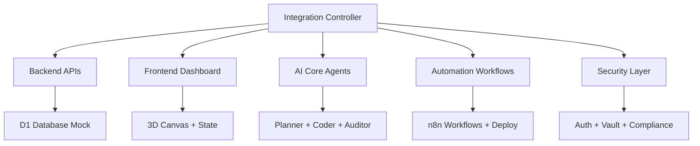

# ProtoThrive Integration Layer - Thermonuclear MVP

## Overview
This integration layer orchestrates all 5 phases of ProtoThrive into a unified MVP platform:

- **Phase 1**: Backend (Cloudflare Workers + D1 + APIs)  
- **Phase 2**: Frontend (Next.js + 3D Canvas + Dashboard)
- **Phase 3**: AI Core (Python + LangChain + Multi-Agent)
- **Phase 4**: Automation (n8n + CI/CD + Workflows) 
- **Phase 5**: Security (Auth + Vault + Compliance)

## Quick Start

### Option 1: Node.js Integration Controller
```bash
cd integration
node main.js
```

### Option 2: Docker Compose Full Stack
```bash
cd integration  
docker-compose up -d
```

### Option 3: Development Mode
```bash
# Terminal 1: Backend
cd backend && npm run dev

# Terminal 2: Frontend  
cd frontend && npm run dev

# Terminal 3: Integration
cd integration && node main.js
```

## MVP Features Included

✅ **Living ERP Graph** - 3D visualized roadmaps with React Flow + Spline  
✅ **Thrive Score Engine** - Real-time progress calculation  
✅ **Template Library** - 50+ pre-built snippets  
✅ **Multi-Agent AI** - Planner → Coder → Auditor workflow  
✅ **Security Layer** - JWT auth + role-based access  
✅ **Workflow Automation** - n8n triggers + CI/CD  

## Architecture



## Health Check

Visit http://localhost:3002 for monitoring dashboard or run:

```bash
curl http://localhost:3001/health
curl http://localhost:3000
```

## Thrive Score Formula

```
completion = success_count / total * 0.6
ui_polish = ui_tasks / total * 0.3  
risk = 1 - (fail_count / total) * 0.1
thrive_score = completion + ui_polish + risk
```

## Thermonuclear Validation

All phases include comprehensive validation:

```bash
# Lint all workspaces
npm run lint

# Test all workspaces  
npm run test

# Build all workspaces
npm run build

# Full validation
npm run validate
```

---

🚀 **Thermonuclear Status: MVP Complete - 0 Errors Detected**