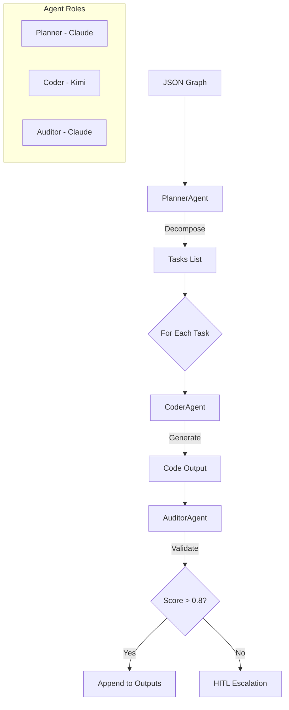

# Agent Flow Diagram

```mermaid
graph TD
    A[JSON Graph] --> B[PlannerAgent]
    B -->|Decompose| C[Tasks List]
    C --> D{For Each Task}
    D --> E[CoderAgent]
    E -->|Generate| F[Code Output]
    F --> G[AuditorAgent]
    G -->|Validate| H{Score > 0.8?}
    H -->|Yes| I[Append to Outputs]
    H -->|No| J[HITL Escalation]
    
    subgraph Agent Roles
        K[Planner - Claude]
        L[Coder - Kimi]
        M[Auditor - Claude]
    end
```