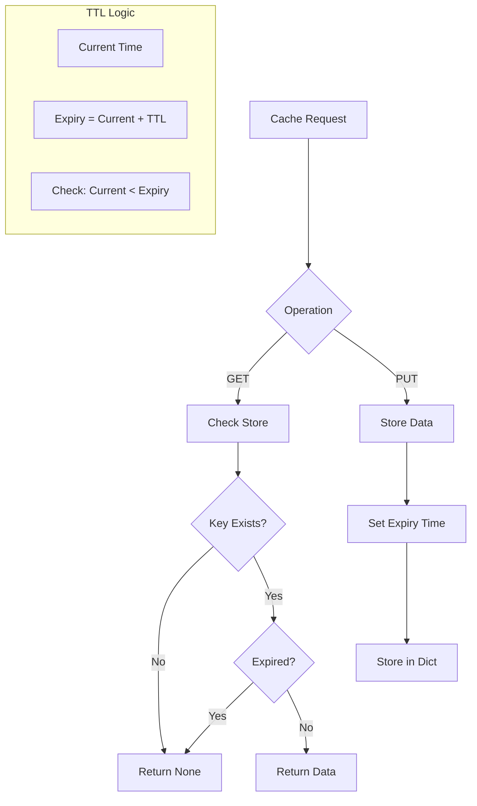

# Cache Flow Diagram

```mermaid
graph TD
    A[Cache Request] --> B{Operation}
    B -->|GET| C[Check Store]
    C --> D{Key Exists?}
    D -->|No| E[Return None]
    D -->|Yes| F{Expired?}
    F -->|Yes| E
    F -->|No| G[Return Data]
    
    B -->|PUT| H[Store Data]
    H --> I[Set Expiry Time]
    I --> J[Store in Dict]
    
    subgraph TTL Logic
        K[Current Time]
        L[Expiry = Current + TTL]
        M[Check: Current < Expiry]
    end
```