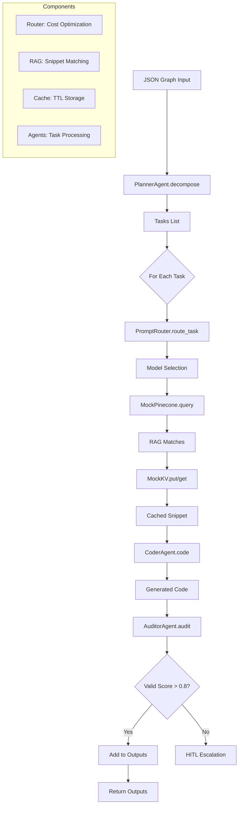

# Orchestration Flow Diagram

```mermaid
graph TD
    A[JSON Graph Input] --> B[PlannerAgent.decompose]
    B --> C[Tasks List]
    
    C --> D{For Each Task}
    D --> E[PromptRouter.route_task]
    E --> F[Model Selection]
    
    F --> G[MockPinecone.query]
    G --> H[RAG Matches]
    
    H --> I[MockKV.put/get]
    I --> J[Cached Snippet]
    
    J --> K[CoderAgent.code]
    K --> L[Generated Code]
    
    L --> M[AuditorAgent.audit]
    M --> N{Valid Score > 0.8?}
    
    N -->|Yes| O[Add to Outputs]
    N -->|No| P[HITL Escalation]
    
    O --> Q[Return Outputs]
    
    subgraph Components
        R[Router: Cost Optimization]
        S[RAG: Snippet Matching]
        T[Cache: TTL Storage]
        U[Agents: Task Processing]
    end
```