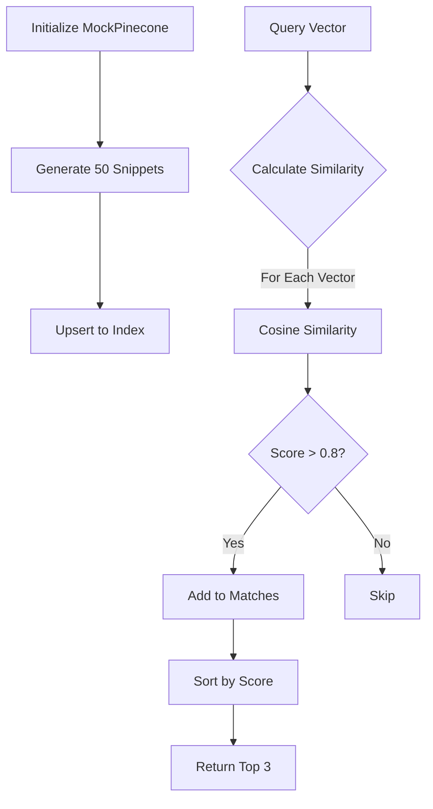

# RAG Flow Diagram

```mermaid
graph TD
    A[Initialize MockPinecone] --> B[Generate 50 Snippets]
    B --> C[Upsert to Index]
    D[Query Vector] --> E{Calculate Similarity}
    E -->|For Each Vector| F[Cosine Similarity]
    F --> G{Score > 0.8?}
    G -->|Yes| H[Add to Matches]
    G -->|No| I[Skip]
    H --> J[Sort by Score]
    J --> K[Return Top 3]
```