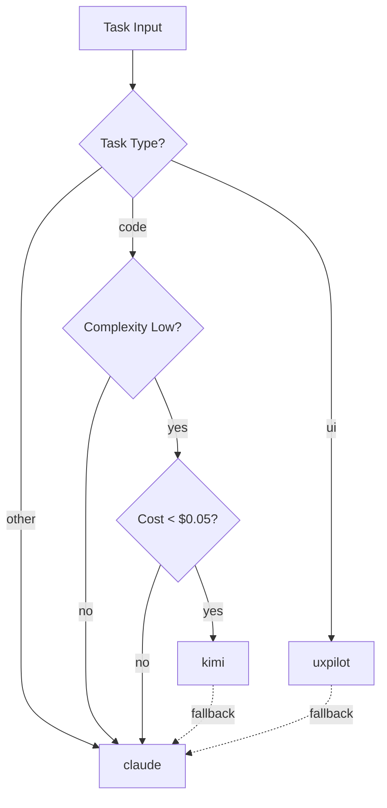

# Router Flow Diagram

```mermaid
graph TD
    A[Task Input] --> B{Task Type?}
    B -->|code| C{Complexity Low?}
    B -->|ui| D[uxpilot]
    B -->|other| E[claude]
    C -->|yes| F{Cost < $0.05?}
    C -->|no| E
    F -->|yes| G[kimi]
    F -->|no| E
    G -.->|fallback| E
    D -.->|fallback| E
```